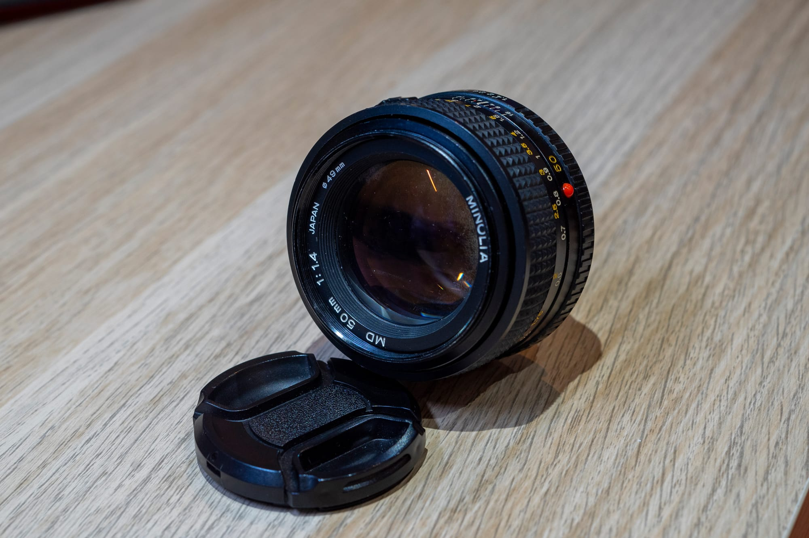

I got this lens with my XD-7. So far it seems like a lovely lens and a contender to take over as my main lens (dethroning the 50mm f/1.7).
It's bigger and heavier but not as much to make it cumbersome to use, especially on the much smaller body that is the XD-7.
Sadly my copy had some fungus, but thankfully the previous owner has taken care of that with some UV treatment. The marks left by the fungus is still visible but it's only on the edges of the front element and it seems like it doesn't really make an impact on the image quality.
I'll probably have to get a copy in a much better shape at some point, but it seems like this might actually be one of my favourite lenses for this mount (though I've yet to try the 50mm f/1.2... maybe one day).